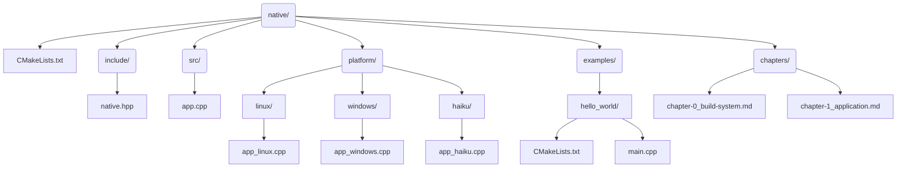

# Chapter 0: build system and directory organization

This chapter outlines the **build system** and **directory structure** used for the `native` library.

The project uses **CMake** for its build system, with the goal of being simple, cross-platform, and easy to extend as more functionality is added.

## Build System Overview

`native` uses **CMake**, a widely adopted and portable build system generator.  
- It supports Linux, Windows, and Haiku out of the box.
- It allows for clear separation of platform-specific code.
- It provides flexibility to include multiple build targets (static libraries, shared libraries, tests, examples).

### Requirements
- CMake 3.16 or higher
- A C++20 compliant compiler  
  - GCC 10+, Clang 11+, or MSVC 2019+

---

## Directory Structure

The project is organized as follows:

## Directory Structure

This directory layout separates platform-independent code, platform-specific implementations, examples, and documentation into clear and distinct locations.